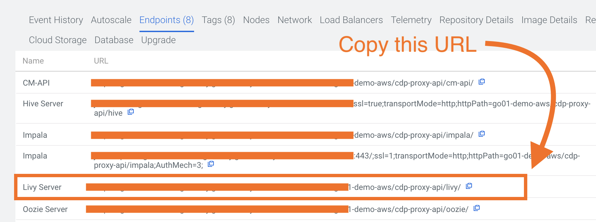
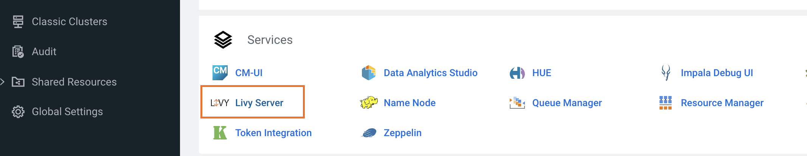
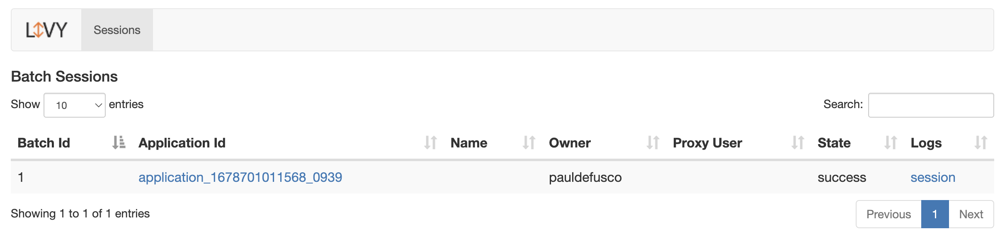

# Submitting a Spark Job to Data Hub via Livy

You can submit a Spark Job to DataHub from a remote machine. In this example we will use CML to trigger a Spark Job in DataHub.

It's important to notice that you can also execute and orchestrate Spark Jobs in CML and CDE. The two offer a superior set of features in terms of Orchestration, Infrastructure Management and Scalability, Development, Interactivity and DevOps.

CDE is the ideal choice for Spark Batch jobs. It features compatibility with the Iceberg Table Format, Airflow for orchestration, Yunikorn and Kubernetes for Cost Efficiency, Scalability and Workload Isolation, and a rich set of API's for DevOps and integration with 3rd party tools and frameworks. You can learn more about CDE at [this page](https://docs.cloudera.com/data-engineering/cloud/index.html).

CML is the ideal choice for interactive Spark Sessions in Notebooks. It features compatibility with the Iceberg Table Format, Kubernetes Workload Isolation, MLFlow to iterate through many experiments in parallel, Spark Runtime Add-Ons to easily prototype code in different versions of Spark, and the ability to productionize your SparkML models via managed-API Endpoints. You can learn more about CML at [this page](https://docs.cloudera.com/machine-learning/cloud/index.html).

### Requirements

To reproduce this project you will need:
* A CML Workspace in CDP Public Cloud (AWS and Azure ok)
* A CDP DataHub in the CDP Public Cloud Environment with Spark. This example is based on Spark 2 but it can be easily adapted to run with Spark 3.
* Basic familiarity with Spark and Python.

### Project Setup

Log into your CML Workspace and create a CML Project as a clone to this git Repository. Select a Runtime with Python 3.7 or above.

All files and dependencies will be automatically loaded into the CML Project Files.

### Steps to Reproduce

Launch a CML Session with Workbench Editor. A basic CML Resource Profile with minimum CPU/Mem will suffice.

```
Kernel: python
Version: any version available
Runtime Editor: Workbench
Runtime Edition: Standard
Enable Spark: Select any Add-On with Spark 2.4.x
Resource Profile: 1 vCPU / 2 GiB - No GPU required.
```

#### Create a directory in Cloud Storage

Open the CML Terminal and run the following command:

```hdfs dfs -mkdir s3a://<STORAGE_LOCATION>/datahub_livy_sparksubmit```

If you don't know your STORAGE_LOCATION parameter you can obtain it by executing script "get_storage.py" in the same CML Session.

#### Copy the Example Jar from CML to S3  

In the CML Terminal, execute the following command to copy the Spark Example Jar to S3:

```hdfs dfs -cp /opt/spark/examples/jars/spark-examples_2.11-2.4.7.1.13.247211.0-28.jar s3a://<STORAGE_LOCATION>/datahub_livy_sparksubmit```

#### Trigger the Spark Job in Data Hub

Open "spark_submit.py" the CML Workbench Editor and add the following values at lines 75-77:



* URL: obtain this from the CDP DataHub cluster -> Endpoints tab
* Username: your CDP Workload User. This is the same as your CML Username.
* Password: your CDP Workload Password. This is the same as your CML Password.

Execute "spark_submit.py". You should see confirmation of submission and execution in your CML Session prompt on the right side of your screen.

Navigate to your CDP Data Hub cluster, open Livy and validate that your Spark Job has run.






## Conclusion & Next Steps

In this example you have triggered a Spark Job in CDP Data Hub from a CML Session. As mentioned in the introduction, DataHub is not the preferred choice for running Spark Jobs in CDP and we encourage exploring these CML and CDE Spark Examples:

* [Credit Scoring with SparkML in CML](https://github.com/pdefusco/Credit_Scoring_SparkML)
* [Experimenting at Scale and Productionizing SparkML Models with MLFlow and Iceberg in CML](https://github.com/pdefusco/Using_CML_MLFlow)
* [An Introduction to CDE Spark, Airflow and DevOps APIs](https://github.com/pdefusco/CDE_First_Step)
* [A DevOps project with GitLab CI and CDE to integrate CDE Pipelines across multiple Clusters](https://github.com/pdefusco/Gitlab2CDE)
